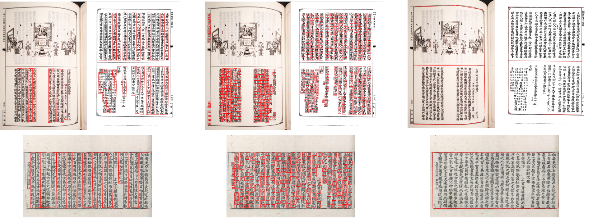

# TKH-MTH2200 Description

The dataset shared in this project is the Tripitaka Koreana in Han (TKH) Dataset and the Multiple Tripitaka in Han (MTH) Dataset.
To facilitate the research in Chinese historical documents,
we extend the size of the [original dataset](https://github.com/HCIILAB/TKH_MTH_Datasets_Release) with layout, characters, and text lines annotation.
More challenging document images from the Internet are added to MTH dataset whose images number is now 2200, therefore named TKH-MTH2200.

In this dataset, we provide three types of annotations(Samples are shown in Visualization).
- The first type is line-level annotation, including text line location and its transcription, which is saved in reading order.
- The second type is character-level annotation, which includes class categories and bounding box coordinates.
- The last type is the boundary lines, represented by the start and end points of line segments.

We randomly split the TKH-MTH2200 dataset into training set and test set with the ratio of 3:1.
Details of the training set and test set can also be viewed in this project.


# Visualization




# Download

[[Google Drive]](https://drive.google.com/file/d/1JOFWYmiM2Ljcn1qJII2yHSGNA_0eouaj/view?usp=sharing)

[[Baidu Drive]](https://pan.baidu.com/s/1a4JdmAZnFGDFsWkqn-BSfg)  code: __eweb__


# Citation

```
@article{
    title={Joint Layout Analysis, Character Detection and Recognition for Historical Document Digitization},
    author={Weihong Ma, Hesuo Zhang, Lianwen Jin, Sihang Wu, Jiapeng Wang, Yongpan Wang},
    journal={ICFHR 2020},
    year={2020}
}
```

# Acknowledgement

The authors sincerely thank Beijing Longquan Monastery for organizing volunteers to help building the datasets.

This research is supported in part by NSFC (Grant No.:61936003), GD-NSF (no 2017A030312006), the National Key Research and Development Program of China (No.2016YFB1001405), Guangdong Intellectual Property Office Project (2018-10-1), and Fundamental Research Funds for the Central Universities (x2dxD2190570).

# Contact

The TKH-MTH2200 dataset is free to the academic community for research purpose usage only.

For any questions about this dataset please contact the authors by sending email to and scutmaweihong@gmail.com and eelwjin@scut.edu.cn.